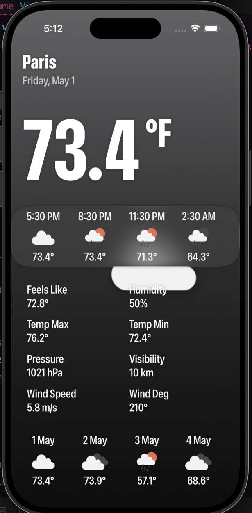
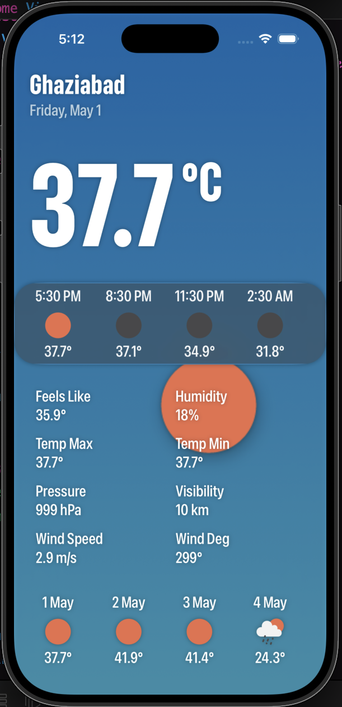
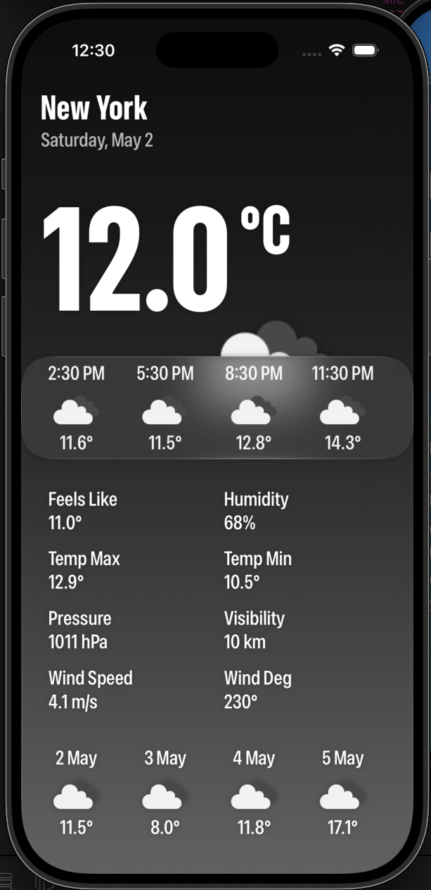
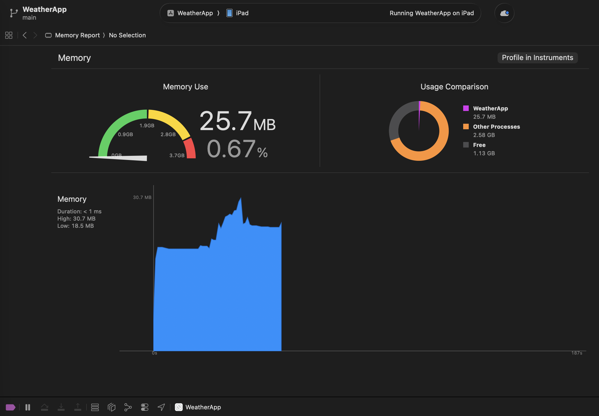
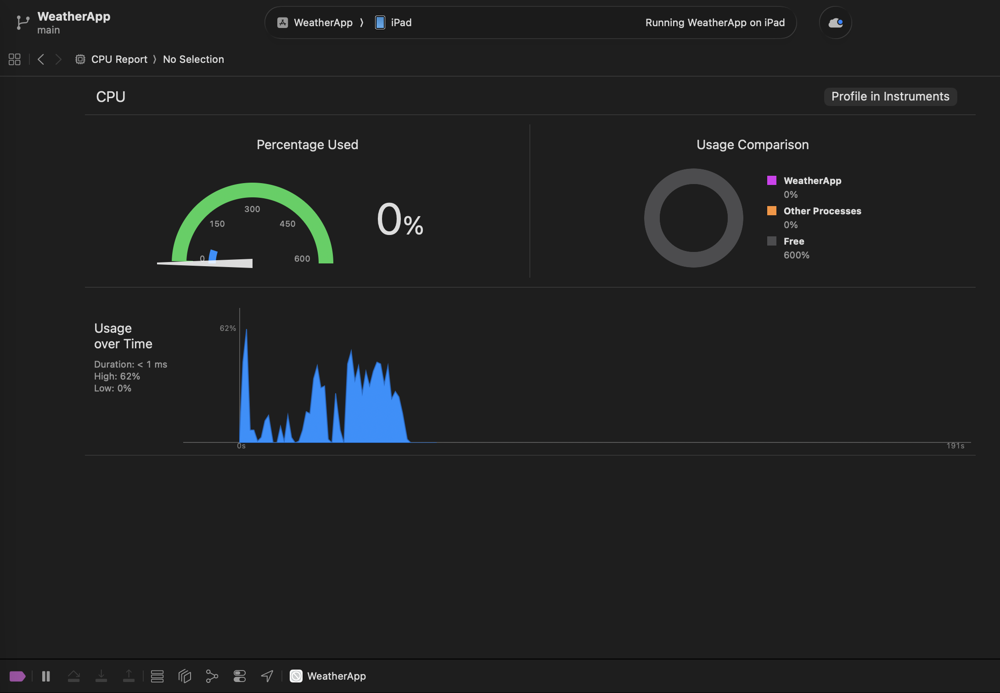

# WeatherApp
  A highly responsive weather application featuring dynamic, data-driven theming and real-time API integrations. Built with a focus on fluid UI and a minimal memory footprint.

---

# Performance Profiles
 - Benchmarked via Xcode Instruments
 - Memory: ~18MB - 19MB idle, ~20MB - 22MB normal usage, peaks at ~30MB during stress test (rapid location switching and network fetching).
  CPU: 0% idle footprint, peaks at ~62% during stress test.

---

# Features
 - 🎨 **Dynamic Theming:** Background gradients adapt in real-time based on live weather conditions.
 - ☀️ **Time-Aware UI:** Weather icons animate dynamically (top→bottom for day, bottom→top for night) driven by live API sunrise/sunset data.
 - 🌡️ **Interactive Data:** Tap temperature to instantly toggle °C / °F and trigger live data refetches.
 - 📍 **Quick Navigation:** Tap the location header to switch between 6 pre-configured global cities via a native dropdown menu.
 - ⏱️ **Deep Forecasting:** Includes a 3-hour interval hourly forecast strip and a comprehensive 4-day daily outlook.
 - 💨 **Advanced Metrics:** Displays "feels like" temperature, humidity, pressure, visibility, wind speed, and wind direction.
 - 🌐 **Chained Networking:** Dual API call architecture — fetches current weather and seamlessly chains coordinates to fetch the extended forecast.

---

# Tech Stack

| Layer | Technology |
|---|---|
| UI & State | SwiftUI + `@Observable` |
| Networking | `URLSession` + `async/await` |
| Data Source | OpenWeatherMap REST API |
| Assets | `AsyncImage` |

  - Single-File MVVM This project utilizes a centralized WeatherData model as the observable state, treating SwiftUI views as pure rendering layers.
  - Engineering Note: This repository served as the architectural baseline for strict state management. The architecture was subsequently scaled into a fully modular Protocol-Oriented pattern in my [Expense Tracker](https://github.com/SynxGentox/Expense-Tracker) and true Clean Architecture with Dependency Injection in my [Aria AI](https://github.com/SynxGentox/Aria-AI) projects.

---
  
# Screenshots
   
   
   
   
   

---

# Setup & Installation
 - Clone the repository.
 - Create a Secrets.swift file in the root directory (this file is ignored in .gitignore for security) and add your OpenWeatherMap API key: Swift

  ```swift
struct Secrets {
    static let weatherAPIKey = "YOUR_KEY_HERE"
}
```

